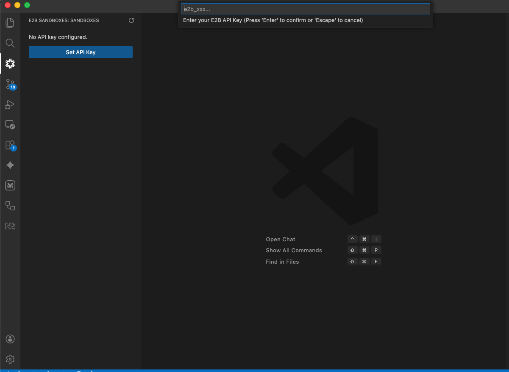
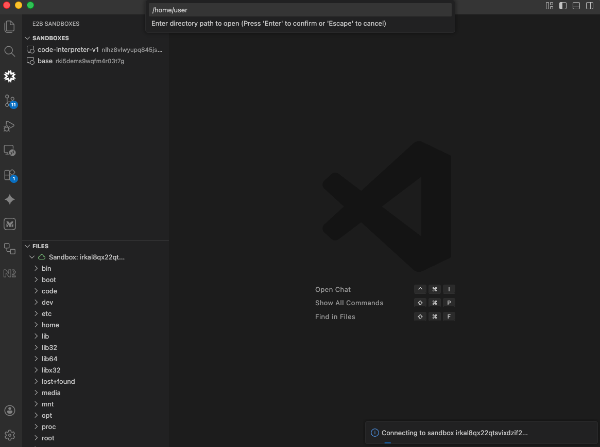
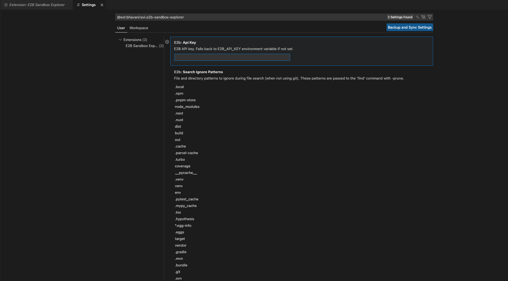

# E2B Sandbox Explorer


<p align="center">
  <a href="https://marketplace.visualstudio.com/items?itemName=bhavaniravi.e2b-sandbox-explorer"></a>
  <a href="https://x.com/bhavaniravi_"></a>
  <a href="https://youtube.com/@bhavaniravi"></a>
</p>

A VS Code extension that lets you connect to [E2B](https://e2b.dev) sandboxes and interact with them directly from your editor. Browse files, edit code, search, and run terminal commands - all within VS Code.

## **[Install from VS Code Marketplace](https://marketplace.visualstudio.com/items?itemName=bhavaniravi.e2b-sandbox-explorer)**

## Quick Start

1. **Set API Key**: Open E2B view → Click "Set API Key" → Enter your key from [e2b.dev](https://e2b.dev)
2. **Connect**: Click the plug icon next to a running sandbox → Choose directory path
3. **Browse & Edit**: Navigate files in the tree view, click to open and edit
4. **Search**: Use the search icon to quickly find files with fuzzy search
5. **Terminal**: Click terminal icon for interactive shell access

## Features & Usage

### 🔑 1. Set Your E2B API Key

First time setup:
1. Open the E2B Sandboxes view in the activity bar (cloud icon)
2. Click "Set API Key" or press `Ctrl+Shift+P` and run "E2B: Set API Key"
3. Enter your E2B API key (get one at [e2b.dev](https://e2b.dev))



**Tip:** You can also set the `E2B_API_KEY` environment variable or configure it in [Settings](#configuration).

---

### 🔌 2. Connect to E2B Sandboxes

**Features:**
- List all your running E2B sandboxes
- Connect to multiple sandboxes simultaneously
- Visual connection status indicators
- Choose custom directory paths

**How to connect:**
1. Your running sandboxes appear in the **E2B Sandboxes** view
2. Click the **Connect** icon (plug) next to a sandbox
3. Enter the directory path you want to browse (default: `/home/user`)
4. The sandbox files will appear in the **Files** view



---

### 📁 3. File Management

**Features:**
- Browse sandbox files in a dedicated tree view
- Create, edit, delete, and rename files and folders
- Full VS Code editor integration with syntax highlighting
- Files accessible via `e2b://` URI scheme
- Changes sync automatically to the sandbox

**How to manage files:**
- **Navigate**: Click through folders in the Files view
- **Open files**: Click any file to open it in the editor with full syntax highlighting
- **Edit & Save**: Make changes and save (`Ctrl+S` / `Cmd+S`) - syncs automatically to sandbox
- **Create**: Click the **New File** or **New Folder** icons in the toolbar
- **Delete**: Right-click on files/folders and select "Delete"

---

### 4. Settings

Access via: **Preferences > Settings > Extensions > E2B Sandbox Explorer**

Or press `Ctrl+Shift+P` (or `Cmd+Shift+P`) and type "Preferences: Open Settings (UI)", then search for "E2B".



#### Available Settings

**`e2b.apiKey`** (string)
- Your E2B API key
- Optional - falls back to `E2B_API_KEY` environment variable if not set
- Can be updated anytime through the Settings UI or command palette

**`e2b.searchIgnorePatterns`** (array of strings)
- File and directory patterns to ignore during file search (when not using git)
- Default includes common patterns for all major languages/frameworks
- Customize to add project-specific patterns or remove defaults
- Only applies to non-git directories (git repos always respect `.gitignore`)


### 🔍 5. Smart File Search

**Features:**
- Fast file indexing with real-time progress (10-100x faster than recursive API calls)
- **Git Integration**: Automatically respects `.gitignore` in git repositories
- **Built-in Filters**: Ignores common dependency directories (node_modules, venv, target, etc.)
- **Smart Caching**: Results cached for 5 minutes for instant subsequent searches
- **Auto-invalidation**: Cache updates when files are created/deleted
- Context-aware: Search entire sandbox or specific directories
- Fuzzy search through all indexed files

**How to search:**
1. Click the **search icon** next to a sandbox or folder (inline or right-click menu)
2. If cached results exist, choose to use them or refresh
3. Files are indexed with progress tracking ("Indexing X / Y files")
4. Use the fuzzy search picker to find and open files

**Search automatically:**
- Git repos: Uses `git ls-files` (respects `.gitignore`)
- Non-git: Uses `find` with smart ignore patterns
- Shows file count: "Search 142 files in /home/user"
- Results cached for 5 minutes

---

### 💻 5. Integrated Terminal

**Features:**
- Interactive PTY sessions directly in VS Code
- Multiple terminals per sandbox
- Full shell support with proper input/output handling
- Seamless integration with VS Code's terminal UI

**How to use:**
- Click the **terminal icon** in the Files view toolbar
- Or right-click a connected sandbox and select "Open Terminal"
- Use like any VS Code terminal - fully interactive shell with your sandbox environment
- Open multiple terminals per sandbox as needed

---

### ⚙️ 6. Disconnect & Manage

**How to disconnect:**
- Click the **disconnect icon** in the Files view toolbar
- Or right-click a connected sandbox and select "Disconnect"
- All terminals for that sandbox will be properly cleaned up

---

### ⚡ Performance Highlights

This extension is optimized for speed and efficiency:

- **Fast Indexing**: Uses bash commands (`find`/`git ls-files`) instead of recursive API calls - 10-100x faster
- **Intelligent Caching**: File indexes cached with 5-minute TTL, auto-invalidated on changes
- **Progress Tracking**: Real-time progress for long operations with cancel support
- **Context-Aware**: All operations scoped to selected sandbox/directory
- **Multi-Sandbox**: Connect to multiple sandboxes simultaneously without performance degradation


## Installation

### From VS Code Marketplace (Recommended)

**Option 1: Install via VS Code**
1. Open VS Code
2. Press `Ctrl+Shift+P` (or `Cmd+Shift+P` on Mac)
3. Type "Extensions: Install Extensions"
4. Search for "E2B Sandbox Explorer"
5. Click Install

**Option 2: Install via Command Line**
```bash
code --install-extension bhavaniravi.e2b-sandbox-explorer
```

**Option 3: Install via Web**
- Visit the [marketplace page](https://marketplace.visualstudio.com/items?itemName=bhavaniravi.e2b-sandbox-explorer)
- Click the "Install" button

### From VSIX (Development/Testing)
1. Download the latest `.vsix` file from releases
2. Open VS Code
3. Press `Ctrl+Shift+P` (or `Cmd+Shift+P` on Mac)
4. Type "Extensions: Install from VSIX"
5. Select the downloaded file

### From Source (Development)
```bash
# Clone the repository
git clone <repository-url>
cd e2b-vscode

# Install dependencies
bun install

# Compile the extension
bun run compile

# Open in VS Code
code .

# Press F5 to launch Extension Development Host
```

### Environment Variables

- **E2B_API_KEY**: Your E2B API key (fallback if not set in settings)

## File Search Ignore Patterns

The extension automatically ignores common dependency and build directories during file search. These patterns are **fully customizable** via the `e2b.searchIgnorePatterns` setting.

### Default Ignore Patterns

**JavaScript/TypeScript:** `node_modules`, `.next`, `.nuxt`, `dist`, `build`, `out`, `.cache`, `.parcel-cache`, `.turbo`, `coverage`, `.npm`, `.pnpm-store`, `.local`

**Python:** `__pycache__`, `venv`, `.venv`, `env`, `.pytest_cache`, `.mypy_cache`, `.tox`, `.hypothesis`, `*.egg-info`, `.eggs`

**Rust:** `target`

**Go:** `vendor`

**Java/Kotlin:** `.gradle`, `.mvn`

**Ruby:** `.bundle`

**PHP:** `vendor`

**Version Control:** `.git`, `.svn`, `.hg`

**IDEs:** `.idea`, `.vscode`, `.vs`

**Other:** `.DS_Store`, `Thumbs.db`, `tmp`, `temp`, `.tmp`, `.temp`

**Note:** In git repositories, `.gitignore` rules always take precedence over these patterns.

### Customizing Ignore Patterns

1. Open VS Code Settings (`Ctrl+,` or `Cmd+,`)
2. Search for "E2B Search Ignore Patterns"
3. Click "Edit in settings.json" to modify the array
4. Add or remove patterns as needed

Example: Add custom build directories for your project:
```json
{
  "e2b.searchIgnorePatterns": [
    "node_modules",
    "dist",
    "my-custom-output",
    "generated-files",
    "*.log"
  ]
}
```

## Commands

All commands are accessible via `Ctrl+Shift+P` (or `Cmd+Shift+P`):

- **E2B: Set API Key** - Configure your E2B API key
- **E2B: Connect** - Connect to a sandbox
- **E2B: Disconnect** - Disconnect from sandbox(es)
- **E2B: Open Terminal** - Open terminal in sandbox
- **E2B: Search Files** - Search files in sandbox/directory
- **E2B: Refresh** - Refresh sandbox list

## Development

### Prerequisites
- [Bun](https://bun.sh) v1.3.5 or higher
- VS Code 1.80.0 or higher

### Build Commands

```bash
# Install dependencies
bun install

# Compile extension
bun run compile

# Watch mode (auto-recompile on changes)
bun run watch

# Package extension
bun run package
```

### Project Structure

```
src/
├── extension.ts              # Extension entry point
├── e2b/
│   └── client.ts            # E2B SDK wrapper with caching
├── providers/
│   ├── fileSystemProvider.ts    # e2b:// URI handler
│   ├── sandboxListProvider.ts   # Sandbox tree view
│   └── fileTreeProvider.ts      # File tree view
├── commands/
│   └── index.ts             # All command handlers
└── terminal/
    └── sandboxTerminal.ts   # PTY terminal implementation
```

### Architecture Highlights

- **No Workspace Integration**: All files shown in custom activity bar views
- **Multi-Sandbox Support**: Connect to multiple sandboxes simultaneously
- **Smart Caching**: File indexes cached with automatic invalidation
- **Bash Optimization**: Uses `find`/`git ls-files` for fast indexing
- **Context-Aware**: Operations scoped to selected sandbox/directory

## Troubleshooting

### "E2B API key not configured"
- Set your API key via the command palette or environment variable
- Verify the key is correct at [e2b.dev](https://e2b.dev)

### Files not showing after connection
- Check that the directory path exists in the sandbox
- Try refreshing the Files view (refresh icon)
- Verify sandbox is still running

### Search is slow
- First search builds the index (may take a few seconds)
- Subsequent searches use cache (instant)
- Large directories (>10k files) may take longer
- Consider searching specific subdirectories

### Cache not invalidating
- Cache auto-invalidates on file create/delete/rename
- Manual refresh: disconnect and reconnect
- Cache expires after 5 minutes automatically

## License

MIT License - see [LICENSE](LICENSE) file for details

## Links

- [E2B Documentation](https://e2b.dev/docs)
- [E2B Website](https://e2b.dev)
- [VS Code Marketplace](https://marketplace.visualstudio.com/items?itemName=bhavaniravi.e2b-sandbox-explorer)
- [Changelog](CHANGELOG.md)
- [Report Issues](https://github.com/e2b-dev/vscode-extension/issues)
- [Source Code](https://github.com/e2b-dev/vscode-extension)
